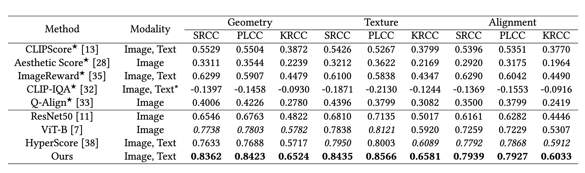

# T23D-QA-Baseline

Offical code of the baseline model of T23D-QA.

Download the dataset: https://huggingface.co/datasets/Howie-Lee/T23D-QA/tree/main

```
ln -s data_path ./data/t23d-qa
```

then

```
python main_t23d-qa.py
```

## Performace Comparison



## Citation

```
@inproceedings{Li2025T23DQA,
  author = {Li, Haohui and Qu, Bowen and Gao, Wei},
  title = {T23D-QA: An Open Dataset and Benchmark for Text-driven 3D Generation Quality Assessment},
  year = {2025},
  publisher = {ACM},
  address = {New York, NY, USA},
  booktitle = {Proceedings of the 33rd ACM International Conference on Multimedia (MM '25)},
  pages = {7},
  doi = {10.1145/3746027.3758302},
  location = {Dublin, Ireland},
  series = {MM '25}
}
```